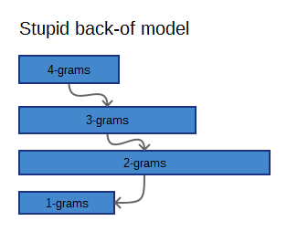

Note, this file is generated form AppExamples.Rmd with
`output: md_document` and embedded into the app using
`includeMarkdown("AppAbout.md")` in ui.R.

[GitHub](https://github.com/Muhomorik/DSS_Capstone) for details. [Slide
deck](http://rpubs.com/Muhomorik/dssSlides)

Foreword
========

This is a final project for [Data Science
Specialization](https://www.coursera.org/specializations/jhu-data-science)
at Coursera.

Final words
-----------

I am slightly disappointing by the JHU and SwiftKey for ignoring the
project.

I think JHU should have provided a set with predicted values to train a
model. Because predicting the Quiz results without being able to
evaluate a model first is... tricky.

My model predicts values based on the current set, but it took me **16
HOURS** to build it on 30% corpus.

Nevertheless, I learned a lot by working on it and I hope it will help
me somehow in the future. Also, I would have done it different next
time.

Overview
--------

-   Some numbers
-   Prediction
-   How it works (short)

Some numbers
------------

NGrams by N-size chart and creation time for each ngram table in hours.

<!-- -->

Same table in text, the scaling defines the size of corpus (2 means 1/2
of file).

<table style="width:85%;">
<colgroup>
<col width="13%" />
<col width="18%" />
<col width="19%" />
<col width="16%" />
<col width="16%" />
</colgroup>
<thead>
<tr class="header">
<th align="left">nGram</th>
<th align="left">skipGram</th>
<th align="left">GramsSize</th>
<th align="left">scaling</th>
<th align="left">runtime</th>
</tr>
</thead>
<tbody>
<tr class="odd">
<td align="left">
1
</td>
<td align="left"><pre><code>0</code></pre></td>
<td align="left">
109249
</td>
<td align="left"><pre><code>1</code></pre></td>
<td align="left"><pre><code>4</code></pre></td>
</tr>
<tr class="even">
<td align="left">
2
</td>
<td align="left"><pre><code>0</code></pre></td>
<td align="left">
504013
</td>
<td align="left"><pre><code>3</code></pre></td>
<td align="left">
5.5
</td>
</tr>
<tr class="odd">
<td align="left">
3
</td>
<td align="left"><pre><code>0</code></pre></td>
<td align="left">
543075
</td>
<td align="left"><pre><code>3</code></pre></td>
<td align="left">
16.1
</td>
</tr>
<tr class="even">
<td align="left">
4
</td>
<td align="left"><pre><code>0</code></pre></td>
<td align="left">
275753
</td>
<td align="left"><pre><code>3</code></pre></td>
<td align="left">
18.5
</td>
</tr>
</tbody>
</table>

For storage, the SQLite database is used. Db stores values in binary
format. That is very compact and only takes **44.0 MB**.

Prediction
----------

App uses a simplest Stupid Back-off prediction scheme. First it tries to
find a matching four-grams and if it fails - goes down to trigrams,
bigrams and unigrams. Size of bars shows appr. ngram size.

The tricky past was filtering the twitter set because it includes lot's
of typos, hash tags (appr. 60%) and web pages. In fact, words like:
"aaaaaghhhhh" are still in prediction table because they are widely
used, but have a very low values.

My own tests shows 68-75% coverage for bigrams depending on skip-grams
and test set.

To illustrate the idea all intermediate steps return prediction.

I am using [quanteda](https://github.com/kbenoit/quanteda) package and
`inversemax` weightening scheme described here:
[https://en.wikipedia.org/wiki/Tf–idf](https://en.wikipedia.org/wiki/Tf–idf).

The inverse document frequency is a measure of how much information the
word provides, that is, whether the term is common or rare across all
documents. Basically, as a term appears in more documents, the ratio
inside the logarithm approaches 1, bringing the idf and tf-idf closer to
0.

In other words, in this application lower values is better.

How it works (short)
--------------------

Pre-processed values are stored in the SQLite database and accessed
using the [RSQlite](https://github.com/rstats-db/RSQLite) package.

User input is spitted and filtered into the variables that are passed to
the query builder and SQLite database. The result (last row) is
returned.

How it works (long)
-------------------

The app includes offline part, pre-processing database, and online and
online part, app.

Offline part and pre-processing are described in the [GitHub
repo](https://github.com/Muhomorik/DSS_Capstone).

Some top predictors are listed in the Examples section, try entering
them slowly and see how values changes.
