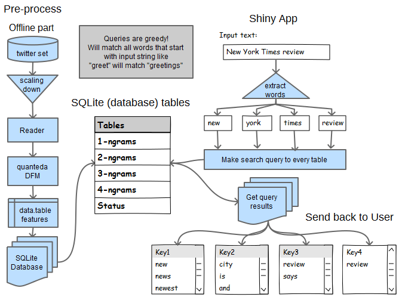
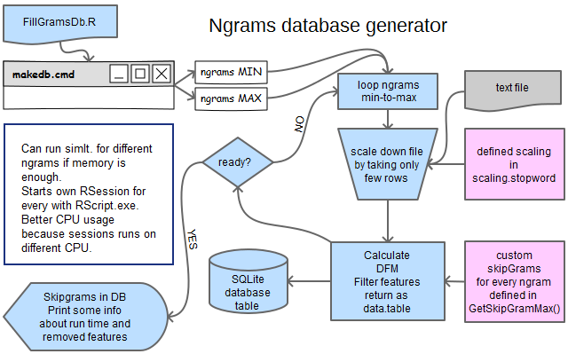
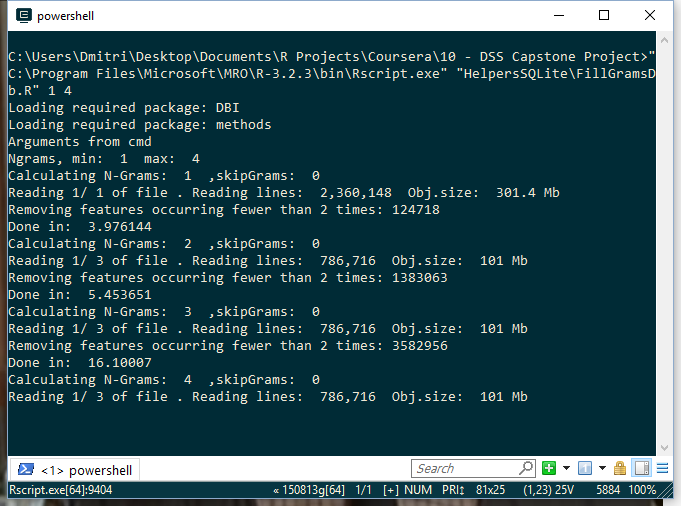
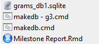

```{r setup, include=FALSE}
knitr::opts_chunk$set(echo = TRUE)
```

```{r includeFiles, message=FALSE, warning=FALSE, include=FALSE}
library(RSQLite)
library(gdata) # humanReadable 
library(pander)
panderOptions("table.style", "grid")

source("HelpersSQLite/SQLiteHelpers.R")
source("HelpersSQLite/QueryString.R")
source("HelpersSQLite/StringToQuery.R")

db_name <- "grams_db1.sqlite"
```

## About ##

:no_entry_sign: This document is automatically generated from [README.Rmd](README.Rmd) :no_entry_sign:

Diagrams are created using [Pencil](http://pencil.evolus.vn/) (.ep file).

# Foreword #

This is a final project for [Data Science Specialization](https://www.coursera.org/specializations/jhu-data-science) at Coursera.

- [Milestone report HTML](http://htmlpreview.github.io/?https://github.com/Muhomorik/DSS_Capstone/blob/master/Milestone_Report.html)
- [Slide deck](http://rpubs.com/Muhomorik/dssSlides), R Presentation.
- [ShinyApp](https://muhomorik.shinyapps.io/10_-_DSS_Capstone_Project/), when running.

This is a **longer** version of *About* page on the Shiny Apps.

Data files are not included, they are >500Mb in size, but are downloaded by the
ngrams generator.

Ready database is not included either because it's too big. It also takes quite a while
to make it from scratch and the structure is not really described here, so this repo
is useless for anybody else, except for me  :imp:

# Structure #


*App flow*

The app includes offline part, pre-processing database, and online and online part, app.

Offline part and pre-processing are described later here.

Some top predictors are listed in the Examples section, try entering them slowly and
see how values changes.

## Some numbers ##

NGrams by N-size chart and creation time for each ngram table in hours.

```{r chartNgramSize, echo=FALSE, fig.height=4, fig.width=6, message=FALSE, warning=FALSE}

par(mfrow=c(1,2)) # rws, cols

# db part
con <- SQLiteGetConn(db_name)
q1 <- QueryStringStatusTable()
res <- dbGetQuery(con, q1)
invisible(dbDisconnect(con))

#draw the histogram with the specified number of bins
barplot(res$GramsSize,
        names.arg = res$nGram,
        main = "NGrams count", xlab = "ngram", ylab = "ngram count")

res$runtime <- round(res$runtime, 1)
#draw the histogram with the specified number of bins
barplot(res$runtime,
        names.arg = res$nGram,
        main = "NGrams build time", xlab = "ngram", ylab = "HOURS")


```

Same table in text, the scaling defines the size of corpus (2 means 1/2 of file).

```{r tableNgramSize, echo=FALSE, fig.height=4, fig.width=4, message=FALSE, warning=FALSE}

pander(res)

```

```{r dbFileSize, echo=FALSE, cache=TRUE}

# Calculate the longest row in file.
size.db <- humanReadable(file.info(db_name)$size, standard="SI", unit="MB")

```

For storage, the SQLite database is used. Db stores values in binary format.
That is very compact and only takes **`r size.db`**.

## Prediction ##

App uses a simplest Stupid Back-off prediction scheme. First it tries to find a
matching four-grams and if it fails - goes down to trigrams, bigrams and unigrams. 
Size of bars shows appr. ngram size.

The tricky past was filtering the twitter set because it includes lot's of
typos, hash tags (appr. 60%) and web pages. In fact, words like: "aaaaaghhhhh" are still in prediction
table because they are widely used, but have a very low values.

My own tests shows 68-75% coverage for bigrams depending on skip-grams and test set.

To illustrate the idea all intermediate steps return prediction.


I am using [quanteda](https://github.com/kbenoit/quanteda) package and `inversemax`
 weightening scheme described here: [https://en.wikipedia.org/wiki/Tf–idf](https://en.wikipedia.org/wiki/Tf–idf).


*inversemax formula*

The inverse document frequency is a measure of how much information the word provides, that is, whether the term is common or rare across all documents. Basically, as a term appears in more documents, the ratio inside the logarithm approaches 1, bringing the idf and tf-idf closer to 0.

In other words, in this application lower values is better.

## How it works (short) ##


*Prediction output back to user*

Pre-processed values are stored in the SQLite database and accessed using the 
[RSQlite](https://github.com/rstats-db/RSQLite) package.

User input is spitted and filtered into the variables that are passed to the query 
builder and SQLite database. The result (last row) is returned.

## Data analysis ##

Analysis was done using the `ChecknGramCoverage.R` script (not included?)


*Exploratory data analysis*

Script takes a small sample as Train set and a next sample, not included in Train 
as Test set. Sample is around 3Mb,

Same rules are applied to both sets. Then both results are merged into the *data.table* 
and merged using the `LEFT OUTER JOIN`.

The `LEFT OUTER JOIN` returns all the rows from the left table, filling in matched columns (or NA) from the right table. After that, the row filter is applied, filtering `NA` values on Train.

```{r mergeEx, eval=FALSE}
Result <- merge(freqDt.test,freqDt.train, all.x=TRUE, by="keyName")
Result <-Result[is.na(valueTrain)]#[,long:=nchar(keyName)][long>3]
```

The result table includes missing values, that can be additionally filtered (comment)
by the row length.

The Result is then inspected for max/min values and may show values that should **NOT** have been
filtered out. 

The Train set is expected the same way for values that should have been filtered.

After that, the filter functions, `trim()` and `selectFeature()` are adjusted.
If the result is OK, the filter can be applied to the bigger set.


## Creating database. ##

The prediction data, ngrams, are stored in the single SQLite database file. can easy be viewed and
edited using the (SQLiteStudio (free))[http://sqlitestudio.pl/].


*ngrams generator flow*

The database is created by running a single `FillGramsDb.R` file. 
File accepts *minimum* and *maximum* ngrams values to be calculated and has some 
configuration for other parameters inside.

The script loops he ngrams and writes words to the database file: `r db_name` 


*ngrams generator running*

Image shows generator running inside the [conEmu](https://conemu.github.io/) windows terminal
(it's like cmd.exe, but with tabs).

Best way to run it is to create a `cmd` script with `Rscript.exe`.

```{r cmd_file, eval=FALSE}
"C:\Program Files\Microsoft\MRO\R-3.2.3\bin\Rscript.exe" "HelpersSQLite\FillGramsDb.R" 1 4
```

The R file can be passed to the `Rscript.exe` and will execute in it's own session
with different parameters and without starting the RStudio.

Multiple files can be run at the same time without interfering with each other.


*cmd file*

Parameters can be accessed from R like:

```{r cmdArgs, eval=FALSE}
args <- commandArgs(trailingOnly = TRUE)
nGrams.Min <- as.numeric(args[1])
```


