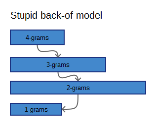
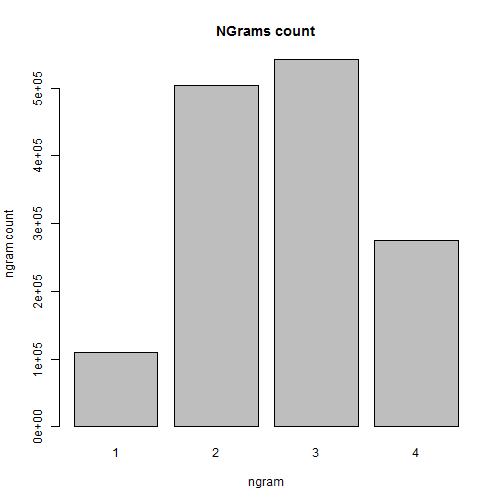

DSS Word prediction
========================================================
author: Dmitri Peredera
date: 2016 April 5
autosize: true

Prediction
========================================================

Application uses a simple prediction scheme

- Check four-grams
- If no four-grams are found, go to lower grams.
- weightening and smoothing is used to get better results.
- Tries to find matches as you type.

Data
========================================================

***

- SQLite file database with 4 columns fr ngrams
- One status column that shows count and processing info.
- File size:  44.0 MB

Instructions
========================================================

- DB is not that big and won't predict quiz questions very good because of
 some design considerations. It does predicts things!
- Start typing at the textbox at top (check other tabs for more information).
- Prediction terms (what program looks for) will appear below.
- Suggesteons for every step will appear in tables below with best match on top.
- Suggestions will suggest *instead* when you are searching for *if* when the rating
is goon enough.

Deployment with other apps
========================================================

- The source can be easily deployed with other applications
as a single SQLite file.
- You have to write your own interface then.
- For using with R apps only 3 files in 'HelpersSQLite' are needed.
- Easy to rebuild DB with setting in file or command line arguments.
- Use *FillGramsDb.R* in R studio or *makedb.cmd* (windows) to rebuild database.

Links
========================================================

For more information about structure visit:

- [GitHub](https://github.com/Muhomorik/DSS_Capstone)
- [ShinyApp](https://muhomorik.shinyapps.io/10_-_DSS_Capstone_Project/)

Visit "About" and "Examples" app tab.

Visit Github for DB generation information.
